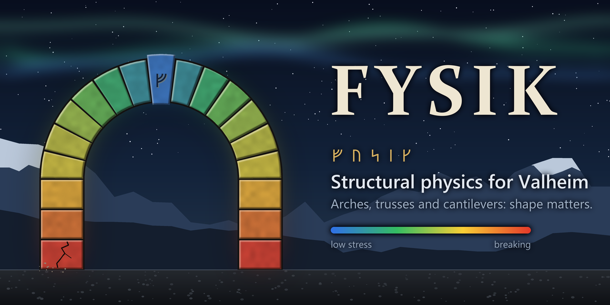

# Fysik

**Structural physics for Valheim building.** Fysik ("physics" in Swedish and Danish) replaces Valheim's
vanilla structural integrity, where a piece only cares about its distance to the ground, with a force
calculation in which the **shape** of a build matters: arches work in compression, triangulated
trusses stay rigid, cantilevers bend. Overloaded pieces crack, shake and creak for a few seconds before
they fall, so there is time to shore them up.

Gameplay references: Poly Bridge, Bridge Constructor.

Players: installation, settings and a **building guide** with worked examples are in the
[package README](package/README.md#building-guide).

> **Status: early access.** Fysik computes the forces, shows them (hammer colors, X-ray view,
> placement preview) and decides what falls: overloaded pieces crack, then fall. Material values are
> still being calibrated.

## How it works

- **Solver:** linear 3D frame analysis (K·u = F, sparse stiffness matrix, conjugate gradient) on each
  connected island of up to `Structure.MaxFrameBodies` pieces (2000 by default, up to 5000); a
  simplified load-path model above that. Each piece is a
  rigid body with 6 degrees of freedom; each joint is an elastic connection whose stiffness comes
  from the two pieces' cross-sections (EA/L, EI/L, GJ/L) between their centres and the contact point.
  Stresses are then checked on cuts across every piece, so a beam resting on a post in the middle
  still sees its own bending.
- **Connections:** every pair of touching pieces is a rigid joint. Walls and floors are approximated
  as equivalent beams. Loads: self-weight only (v1). Simple buckling: slender pieces get a lower
  compression limit. Pieces that hold nothing up (chests, workbenches, torches) add no weight but,
  as in vanilla, need a structural piece or the ground to rest on, and fall without one.
- **Materials:** wood < core wood < stone / iron. Stone is strong in compression with moderate tension.
  Unknown materials from other mods get safe defaults and a log warning.
- **Multiplayer:** only players calculate. Whoever owns a piece (the player near it, as in vanilla)
  solves the whole structure and decides its fate; the calculation is deterministic, so owners of
  different parts of one structure agree, and the crack is synced through the piece's ZDO. The
  dedicated server calculates nothing: it relays, syncs the settings (Jötunn) and hands the pieces
  near the world centre, which it would otherwise keep, to the nearest player. Every player must have the mod
  (`CompatibilityLevel.EveryoneMustHaveMod`).
- **Performance:** recalculation only on events (piece placed, removed or damaged), only on the
  affected island. Reading contacts and building the model stay within ~1–2 ms per frame; the solve
  itself runs on a worker thread (a 2000-piece island in about half a second).

## Roadmap

Next:

- Masonry: stone blocks that only hold by pressing on each other, interlocking walls, arches built on wooden centering
- Loads beyond self-weight: furniture, chest contents, snow on roofs

Later:

- Calibration with player builds (feedback welcome)
- Faster recalculation for very large bases
- Translations into every language Valheim supports
- A website to plan and test a build in the browser with the same solver

## Building from source

Requirements: Windows, Valheim, [r2modman](https://thunderstore.io/c/valheim/p/ebkr/r2modman/) with a
profile that has BepInExPack_Valheim and Jötunn, and the .NET SDK (any recent version; the project
targets .NET Framework 4.6.2 through reference assemblies).

1. Copy `Environment.props.example` to `Environment.props` and set:
   - `ValheimDir`: the game folder (contains `valheim_Data\Managed`).
   - `DevProfileDir`: an r2modman profile **dedicated to testing** (e.g. `Fysik-Dev`). It provides the
     BepInEx and Jötunn references and receives Debug builds. The build refuses to deploy to a profile
     named `Default`.
2. Build:

   ```sh
   dotnet build -c Debug                                   # builds and copies Fysik.dll + .pdb to <profile>/BepInEx/plugins/Fysik
   dotnet test tests/Fysik.Tests                           # solver tests (no game needed)
   dotnet build src/Fysik/Fysik.csproj -c Release -t:Package   # creates dist/Fysik-<version>.zip for Thunderstore
   ```

3. Start the game through the test profile (r2modman: select the profile, then *Start modded*) and
   look for `Fysik <version> loaded` in `<profile>/BepInEx/LogOutput.log`.

The version lives only in `src/Fysik/Fysik.csproj` (`<Version>`); it feeds the plugin attribute
(through `BepInEx.PluginInfoProps`) and the Thunderstore `manifest.json`. `assembly_valheim` is
publicized at build time (`BepInEx.AssemblyPublicizer.MSBuild`), so private game members can be used
directly. Game and third-party DLLs are referenced in place and never committed.

### Repository layout

| Path | Contents |
|---|---|
| `src/Fysik/Structure/` | The solver: pure C#, no Unity types, shared with the tests |
| `src/Fysik/Game/` | Valheim side: piece graph, contacts, display, patches |
| `tests/Fysik.Tests/` | Solver tests against beam theory (cantilever, column, arch, brace, performance) |
| `package/` | Thunderstore `manifest.json` template and the package README |
| `art/` | `icon.png` and `banner.png` |
| `docs/images/` | The building guide's pictures |

### Releasing on Thunderstore

Run the `Package` target and upload `dist/Fysik-<version>.zip`. Select the categories **Building** and
**Mods**. Update `CHANGELOG.md` before each release.

## License

[MIT](LICENSE)
